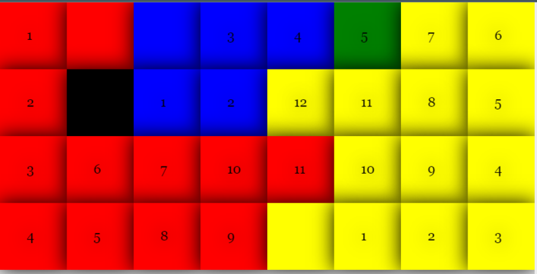

# Planar-Puzzle
Design of software systems - Object Oriented Programming - React, javascript,HTML,CSS,Bootstrap,Node js

##Sample Game play images
•	Select only colored squares 
•	When color square is selected it can only end in other same color square.
o	Example:- In the below image the square orange selected first(no label orange square) and extended, then extension ends in other orange square(labeled as 2). Same goes for other colors in table.
•	Reset to clear the extensions and play again.
•	Solve button checks the solution and display the test – If won the label turns “You Won” as shown in below image(3).

##Configuration -1

##Configuration -2

##Configuration-3

##test case coverage result

##Testing Coverage 
To generate the code coverage, launch `npm test -- --coverage` which produces a file that contains a breakdown of
(Below image is result of coverage for the planarpuzzle code provided in  zip file)

# Getting Started with Create React App
This project was bootstrapped with [Create React App](https://github.com/facebook/create-react-app).

## What to do the first time
The first time you retrieve this code, you will need to install the react scripts to work properly. To do this, type:
`npm install react-scripts --save`
This is a one-time action for this project, which downloads and retrieves the necessary artifacts.

## Available Scripts
In the project directory, you can run:

### `npm start`
Runs the app in the development mode.\
Open [http://localhost:3000](http://localhost:3000) to view it in your browser.
The page will reload when you make changes.\
You may also see any lint errors in the console.

### `npm test`
Launches the test runner in the interactive watch mode.\
See the section about [running tests](https://facebook.github.io/create-react-app/docs/running-tests) for more information.

## Developer tips
Use ctrl+Shift+I – for developer tab – here you can see the page console logs and other erros,warnings.

